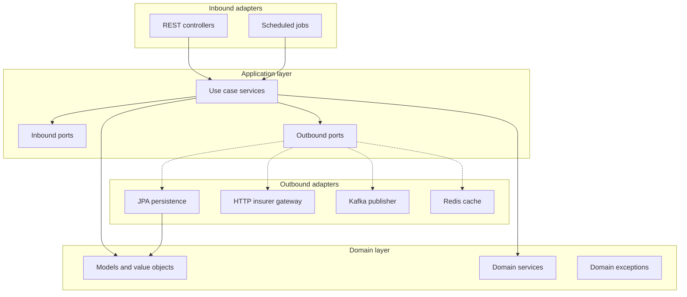

# Trustbuddy API — Agent Instructions

Spring Boot 4.1 REST API (Java 17, Maven, PostgreSQL, JPA, Actuator). Uses **hexagonal architecture** (ports and adapters). Keep changes small, focused, and consistent with the layout below.

## Repository hygiene

### Do not commit

- Build artifacts: `target/`, `build/`, `dist/`
- IDE and editor config: `.idea/`, `*.iml`, `.classpath`, `.project`, `.settings/`
- Local environment files: `.env`, `.env.*`, `application-local.yml`, `application-*.local.yml`
- Secrets: API keys, database passwords, JWT signing keys, connection strings with credentials
- Generated or downloaded binaries: `.mvn/wrapper/maven-wrapper.jar` (already gitignored)
- OS junk: `.DS_Store`, `Thumbs.db`
- Log files and local databases: `*.log`, `*.h2.db`, `*.sqlite`

If a new generated or local-only path appears, add it to `.gitignore` in the same change — do not leave untracked clutter for the next contributor.

### Keep the tree minimal

- Do not add files the project does not need: sample scripts, scratch notes, duplicate READMEs, or one-off SQL dumps.
- Do not create markdown docs unless explicitly requested.
- Remove dead code, unused imports, and commented-out blocks in the same PR that makes them obsolete.
- Prefer editing existing files over adding parallel implementations.

### Configuration

- Shared defaults live in `src/main/resources/application.yml` (universal, no localhost defaults).
- Local development uses `application-dev.yml` (`make run` activates the `dev` profile).
- Docker Compose uses `application-docker.yml` (`make stack-up` activates the `docker` profile).
- Production uses `application-prod.yml` — secrets and infra endpoints must come from the environment.
- Never commit `.env`; use `.env.example` as a template.

## Hexagonal architecture

Business logic lives at the center and must not depend on frameworks. Infrastructure plugs in through **ports** (interfaces) and **adapters** (implementations).



### Dependency rule

Dependencies point **inward only**:

| Layer | May depend on | Must not depend on |
|-------|---------------|-------------------|
| `domain/` | nothing outside domain | Spring, JPA, Kafka, Redis, HTTP |
| `application/` | `domain/` | JPA entities, controllers, Kafka templates |
| `adapter/` | `application/`, `domain/` | other adapters directly |
| `config/` | all layers | business logic |

### Package layout

```
src/main/java/com/trustbuddy/api/
  TrustbuddyApiApplication.java      # entry point only

  domain/
    model/                             # Quote, enums, value objects (pure Java)
    service/                           # PremiumCalculator, QuoteStateTransitionService
    exception/                         # QuoteNotFoundException, InvalidQuoteStateException, etc.

  application/
    port/in/                           # use case interfaces (optional, for large flows)
    port/out/                          # QuoteRepositoryPort, InsurerGatewayPort, QuoteEventPublisherPort, QuoteCachePort
    service/                           # QuoteService, QuoteSubmissionService, DraftExpirationService

  adapter/
    in/web/
      controller/                      # REST endpoints
      dto/                             # request/response objects
      mapper/                          # DTO ↔ domain mappers
      exception/                       # GlobalExceptionHandler, ErrorResponse
      security/                        # JwtAuthFilter, JwtService
    in/scheduler/                      # DraftExpirationJob
    out/persistence/
      entity/                          # QuoteEntity (JPA)
      repository/                      # QuoteJpaRepository
      QuotePersistenceAdapter.java     # implements QuoteRepositoryPort
    out/gateway/                       # InsurerGatewayHttpAdapter (httpstat.us)
    out/messaging/                     # KafkaQuoteEventPublisher
    out/cache/                         # RedisQuoteCacheAdapter

  config/                              # @Configuration — wires ports to adapters
```

### Layer responsibilities

- **Domain** — business rules, premium formula, state transitions, domain exceptions. No annotations except maybe validation on value objects if kept pure.
- **Application** — orchestrates use cases; calls domain services and outbound ports. No HTTP, SQL, or Kafka code.
- **Inbound adapters** — translate HTTP/scheduling into application calls; map domain errors to HTTP responses.
- **Outbound adapters** — implement ports: JPA persistence, external HTTP, Kafka, Redis. Map between domain models and infrastructure types here — not in controllers.
- **Config** — Spring bean wiring only (`@Bean` methods connecting port interfaces to adapter implementations).

### Ports (outbound) for this project

Define interfaces in `application/port/out/`:

| Port | Adapter | Purpose |
|------|---------|---------|
| `QuoteRepositoryPort` | `QuotePersistenceAdapter` | CRUD + expiration query |
| `InsurerGatewayPort` | `InsurerGatewayHttpAdapter` | Real httpstat.us call |
| `QuoteEventPublisherPort` | `KafkaQuoteEventPublisher` | Post-submit Kafka event |
| `QuoteCachePort` | `RedisQuoteCacheAdapter` | Cache get/evict for quotes |

### Do / don't

```
GOOD:  QuoteService(application) → QuoteRepositoryPort → QuotePersistenceAdapter(JPA)
       PremiumCalculator(domain) — pure Java, unit-tested without Spring

BAD:   @Autowired QuoteJpaRepository in QuoteService
       @Entity on domain Quote used directly in controllers
       KafkaTemplate in application service
```

- Controllers stay thin: validate DTO → call application service → map response.
- JPA entities stay in `adapter/out/persistence/entity/` — map to/from domain models in the persistence adapter.
- One public class per file; filename matches the class name.

## REST API conventions

APIs are contracts. Follow these rules for every new or changed endpoint.

### Endpoint design

- Use **nouns**, not verbs. HTTP method carries the action.
- Use **plural** resource names in **kebab-case**.
- Version all public APIs under `/api/v1/...` (increment only for breaking changes).

```
GOOD:  GET    /api/v1/users/{id}
       POST   /api/v1/users
       PUT    /api/v1/users/{id}
       DELETE /api/v1/users/{id}

BAD:   GET /getUserDetailsById/123
       GET /user/{id}
       POST /createUser
```

### HTTP status codes

Return the status that matches the outcome. Do not return `200 OK` for errors.

| Code | When |
|------|------|
| `200 OK` | Successful read or update |
| `201 Created` | Resource created (include `Location` header when appropriate) |
| `204 No Content` | Successful delete with no body |
| `400 Bad Request` | Validation or malformed input |
| `401 Unauthorized` | Missing or invalid authentication |
| `403 Forbidden` | Authenticated but not permitted |
| `404 Not Found` | Resource does not exist |
| `409 Conflict` | Version conflict or duplicate resource |
| `500 Internal Server Error` | Unexpected server failure |

### Exception handling

- Do **not** scatter `try-catch` in controllers.
- Domain and application code throw **domain exceptions** from `domain/exception/`.
- Map exceptions to HTTP in `adapter/in/web/exception/GlobalExceptionHandler` (`@ControllerAdvice` + `@ExceptionHandler`).
- Return a **consistent JSON error shape** for all failures:

```json
{
  "timestamp": "2025-08-21T10:15:30",
  "status": 404,
  "error": "Not Found",
  "message": "User not found with id 123",
  "path": "/api/v1/users/123"
}
```

- Map domain exceptions to the correct HTTP status in the advice class, not in individual controllers.

### Input validation

- Validate at the DTO boundary with Bean Validation (`@Valid` on controller params).
- Apply constraints on request DTOs (`@NotBlank`, `@NotNull`, `@Email`, `@Size`, etc.).
- Let Spring return `400` before business logic runs.

```java
public class UserRequest {
    @NotBlank
    private String name;

    @Email
    private String email;
}
```

- Do not expose JPA entities as request bodies.

### Pagination, filtering, and sorting

- Never return unbounded collections. Use Spring Data `Pageable`.
- Support standard query params: `page`, `size`, `sort`, and domain filters.

```
GET /api/v1/users?page=0&size=20
GET /api/v1/users?role=admin
GET /api/v1/users?sort=name,asc
```

- Default `size` to a reasonable limit (e.g. 20). Reject excessively large `size` values.

### Security

- Treat every endpoint as protected unless explicitly documented as public.
- Use Spring Security for authentication and authorization.
- Prefer JWT or OAuth2 for token-based access.
- Do not log passwords, tokens, authorization headers, or other secrets.
- When Spring Security is added, restrict `/swagger-ui/**` and `/v3/api-docs/**` to non-production profiles.

### API documentation

- Keep OpenAPI in sync with code — annotations are required when adding or changing endpoints.
- Use `io.swagger.v3.oas.annotations` (`@Tag`, `@Operation`, `@ApiResponse`).
- Document request/response DTOs with realistic examples; no real PII or credentials.
- Put global OpenAPI config in `config/OpenApiConfig`, not in controllers.
- Swagger UI: `http://localhost:8080/swagger-ui.html`
- OpenAPI JSON: `http://localhost:8080/v3/api-docs`
- Disable or restrict Swagger UI in production (`springdoc.swagger-ui.enabled=false` or profile-specific config).

### Concurrency

- Add `@Version` on JPA entities that are concurrently updated (optimistic locking).
- Return `409 Conflict` when a stale version is submitted.
- Use pessimistic locking only when optimistic locking is insufficient.

### Observability

- Use structured logging (JSON) in production.
- Include a **request ID** or **correlation ID** in logs for every request.
- Log errors with context (path, status, correlation ID) — never log sensitive payloads.
- Expose metrics via Actuator; keep sensitive actuator endpoints secured in production.

### Checklist for new endpoints

1. Plural kebab-case path under `/api/v1/`
2. Correct HTTP method and status codes
3. Request DTO with `@Valid` and Bean Validation constraints
4. Response DTO (not entity)
5. Global exception mapping in `adapter/in/web/exception/GlobalExceptionHandler`
6. Pagination for list endpoints
7. OpenAPI annotations
8. `@Version` on entities if updates are concurrent

## Code style

- Match existing formatting: tabs for indentation (as in current sources).
- Use constructor injection for Spring beans; avoid field `@Autowired`.
- Add Javadoc only for non-obvious behavior — prefer clear naming over comments.

## Dependencies

- Add dependencies only in `pom.xml` when required by the feature.
- Prefer Spring Boot starters over manual dependency lists.
- Do not pin versions that Spring Boot parent already manages unless there is a documented reason.
- `springdoc-openapi` is pinned via `${springdoc.version}` in `pom.xml` because it is not managed by the Spring Boot BOM (use v3.x for Spring Boot 4).
- Leave the empty `<license>`, `<developers>`, and `<scm>` overrides in `pom.xml` — they intentionally block unwanted inheritance from the parent POM.

## Database and migrations

- Schema changes must be reproducible. Use Flyway or Liquibase once introduced; until then, document manual steps in the PR description.
- Never commit production data or PII in seed files or fixtures.
- Keep repository methods focused; add custom `@Query` only when derived query names become unwieldy.
- Use parameterized queries via JPA — never concatenate SQL strings.

## Testing

Run before finishing any change:

```bash
make test
# or: ./mvnw test
```

Mirror the hexagonal package structure under `src/test/java/com/trustbuddy/api/`:

- **Domain tests** — pure JUnit, no Spring context (`domain/service/`, `domain/model/`)
- **Application tests** — mock outbound ports (`application/service/`)
- **Adapter tests** — `@WebMvcTest` for controllers, `@DataJpaTest` for persistence adapter
- **Integration tests** — `@SpringBootTest` + Testcontainers at `adapter/` or root test package

- Mock outbound ports in application tests; do not require live PostgreSQL for unit tests.
- Use Testcontainers only when testing adapter integration (persistence, Kafka, Redis).
- Every bug fix should include a test that would have caught it.

### Given / When / Then

Structure every test method with three clearly separated sections:

| Section | Purpose |
|---------|---------|
| **Given** | Arrange — build domain objects, seed data, configure mocks |
| **When** | Act — invoke the method or operation under test |
| **Then** | Assert — verify outcomes with AssertJ (or JUnit assertions) |

Use `// Given`, `// When`, and `// Then` comments and a blank line between sections. Keep each section focused on one concern. Smoke tests that only verify context startup may combine **When** and **Then**.

```java
@Test
void saveAndFindById_roundTripsQuoteFields() {
	// Given
	Quote draft = Quote.createDraft("Jane Doe", "jane@example.com", 30, "12345");

	// When
	Quote saved = quoteRepository.save(draft);
	Quote found = quoteRepository.findById(saved.getId()).orElseThrow();

	// Then
	assertThat(found.getName()).isEqualTo("Jane Doe");
	assertThat(found.getStatus()).isEqualTo(QuoteStatus.DRAFT);
}
```

## Verification checklist

Before marking work complete:

1. `./mvnw test` passes with no failures.
2. `./mvnw compile` succeeds (catches missing dependencies and compile errors).
3. No secrets, credentials, or local-only config in the diff.
4. No unrelated files changed (formatting-only sweeps, drive-by refactors).
5. New code follows hexagonal layout and REST API conventions above.
6. `.gitignore` updated if new local artifacts were introduced.

## Git and PR discipline

- Commit only when the user asks. Do not push unless explicitly requested.
- Write commit messages in imperative mood: `Add user registration endpoint`, not `Added...`.
- One logical change per commit/PR — do not mix feature work with cleanup unrelated to the task.
- Do not commit `HELP.md` changes unless updating project documentation is part of the task (it is Spring Initializr boilerplate).

## When unsure

- Read surrounding code and match its patterns before introducing new abstractions.
- Prefer the smallest correct diff over a large refactor.
- Ask before deleting files, changing public API contracts, or adding new top-level dependencies.
