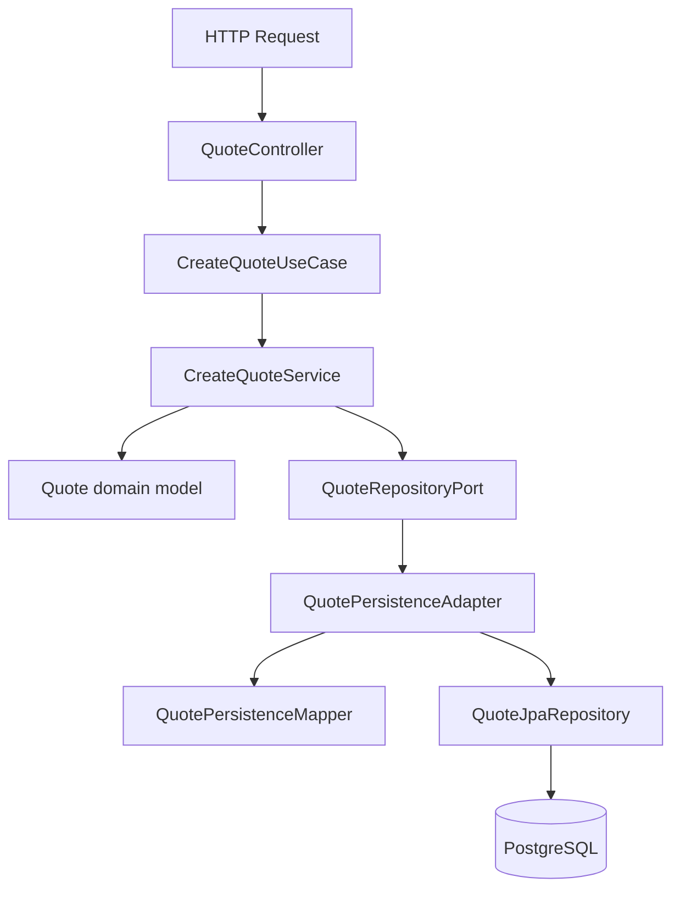

# Trustbuddy API — Architecture

Feature-oriented hexagonal architecture. Each business capability is a vertical slice with its own `domain`, `application`, and `infrastructure` packages. Shared cross-cutting concerns (security, OpenAPI) live at the app root under `config/`.

## Principles

- **Domain** — pure business logic; no Spring, JPA, HTTP, or database code.
- **Application** — use-case orchestration; depends on domain and port interfaces only.
- **Infrastructure** — framework-specific adapters that implement ports.
- **Ports** — interfaces in `application/port/`; implementations only in `infrastructure/`.
- **Mapping** — domain ↔ persistence and domain ↔ API DTOs stays in infrastructure adapters/mappers, not in domain.

Split by **business capability** (`quote/` today; `policy/`, `customer/` later) rather than by technical layer at the root.

## Request flow (quote)



The application layer never knows it is talking to PostgreSQL.

## Root layout

```
src/main/java/com/trustbuddy/api/
  TrustbuddyApiApplication.java    # Spring Boot entry point
  config/                          # shared @Configuration (security, OpenAPI, beans)

  quote/                           # quote capability (feature module)
    application/
    domain/
    infrastructure/
```

Mirror tests under `src/test/java/com/trustbuddy/api/quote/`.

## Quote capability layout

```
quote/
├── application/
│   ├── port/
│   │   ├── in/                    # inbound ports (use case interfaces)
│   │   │   ├── CreateQuoteUseCase.java      (planned)
│   │   │   └── GetQuoteUseCase.java         (planned)
│   │   └── out/                   # outbound ports
│   │       ├── QuoteRepositoryPort.java
│   │       ├── InsurerGatewayPort.java      (planned)
│   │       ├── QuoteEventPublisherPort.java (planned)
│   │       └── QuoteCachePort.java          (planned)
│   ├── service/                   # use case implementations
│   │   ├── CreateQuoteService.java          (planned)
│   │   └── QuoteSubmissionService.java      (planned)
│   └── dto/                       # application-level commands/queries (optional)
│
├── domain/
│   ├── model/                     # Quote, enums
│   ├── valueobject/               # Email, Money, etc. (planned)
│   ├── service/                   # PremiumCalculator, state machine (planned)
│   └── exception/                 # QuoteNotFoundException, etc. (planned)
│
└── infrastructure/
    ├── web/
    │   ├── controller/            # QuoteController (planned)
    │   ├── request/               # API request DTOs (planned)
    │   ├── response/              # API response DTOs (planned)
    │   └── mapper/                # domain ↔ API DTO mappers (planned)
    ├── persistence/
    │   ├── entity/                # QuoteEntity (JPA)
    │   ├── repository/            # QuoteJpaRepository (Spring Data)
    │   ├── adapter/               # QuotePersistenceAdapter
    │   └── mapper/                # QuotePersistenceMapper
    ├── client/                    # InsurerGatewayHttpAdapter (planned)
    ├── messaging/                 # Kafka producer/consumer (planned)
    └── scheduler/                 # DraftExpirationJob (planned)
```

## What belongs in each layer

### Domain (`quote/domain/`)

| Package | Contents |
|---------|----------|
| `model/` | Aggregates and enums (`Quote`, `QuoteStatus`, `CoverageType`) |
| `valueobject/` | Immutable types (`Email`, `Money`) |
| `service/` | Pure domain services (`PremiumCalculator`) |
| `exception/` | `QuoteNotFoundException`, `InvalidQuoteStateException` |

Must compile in a plain Java project — no framework imports.

### Application (`quote/application/`)

| Package | Contents |
|---------|----------|
| `port/in/` | Use case interfaces (`CreateQuoteUseCase`) — what the app can do |
| `port/out/` | Outbound ports (`QuoteRepositoryPort`) — what the app needs |
| `service/` | Use case implementations; depend on ports and domain only |
| `dto/` | Immutable command/query objects for use case inputs (optional) |

Application services orchestrate workflow; they do not contain SQL, HTTP, or Kafka code.

### Infrastructure (`quote/infrastructure/`)

| Package | Contents |
|---------|----------|
| `web/` | REST controllers, request/response DTOs, API mappers, HTTP exception handling |
| `persistence/` | JPA entities, Spring Data repos, persistence adapters and mappers |
| `client/` | HTTP clients to external APIs (insurer gateway) |
| `messaging/` | Kafka producers/consumers |
| `scheduler/` | `@Scheduled` jobs |

This layer implements outbound ports and hosts inbound adapters.

## Ports and adapters

### Inbound (driving)

| Adapter | Location | Invokes |
|---------|----------|---------|
| REST controller | `infrastructure/web/controller/` | `application/port/in/*UseCase` |
| Scheduler | `infrastructure/scheduler/` | application services |
| Kafka consumer | `infrastructure/messaging/` | application services |

### Outbound (driven)

| Port | Adapter | Location |
|------|---------|----------|
| `QuoteRepositoryPort` | `QuotePersistenceAdapter` | `infrastructure/persistence/adapter/` |
| `InsurerGatewayPort` | `InsurerGatewayHttpAdapter` | `infrastructure/client/` |
| `QuoteEventPublisherPort` | `KafkaQuoteEventPublisher` | `infrastructure/messaging/` |
| `QuoteCachePort` | `RedisQuoteCacheAdapter` | `infrastructure/persistence/` or dedicated cache package |

## Dependency rules

| Layer | May depend on | Must not depend on |
|-------|---------------|-------------------|
| `quote/domain/` | nothing outside domain | Spring, JPA, Kafka, Redis, HTTP |
| `quote/application/` | `quote/domain/` | JPA entities, controllers, Kafka templates |
| `quote/infrastructure/` | `quote/application/`, `quote/domain/` | other feature modules directly |
| `config/` | all layers | business logic |

## Adding a new capability

1. Create `src/main/java/com/trustbuddy/api/<capability>/` with `application/`, `domain/`, `infrastructure/`.
2. Define domain models and services first.
3. Add outbound ports in `application/port/out/`.
4. Implement adapters in `infrastructure/`.
5. Add inbound use cases in `application/port/in/` and services.
6. Expose via `infrastructure/web/` controllers.
7. Mirror tests under `src/test/java/com/trustbuddy/api/<capability>/`.

## Related docs

- [AGENTS.md](AGENTS.md) — agent instructions, REST conventions, testing checklist
- [README.md](README.md) — setup and run instructions
