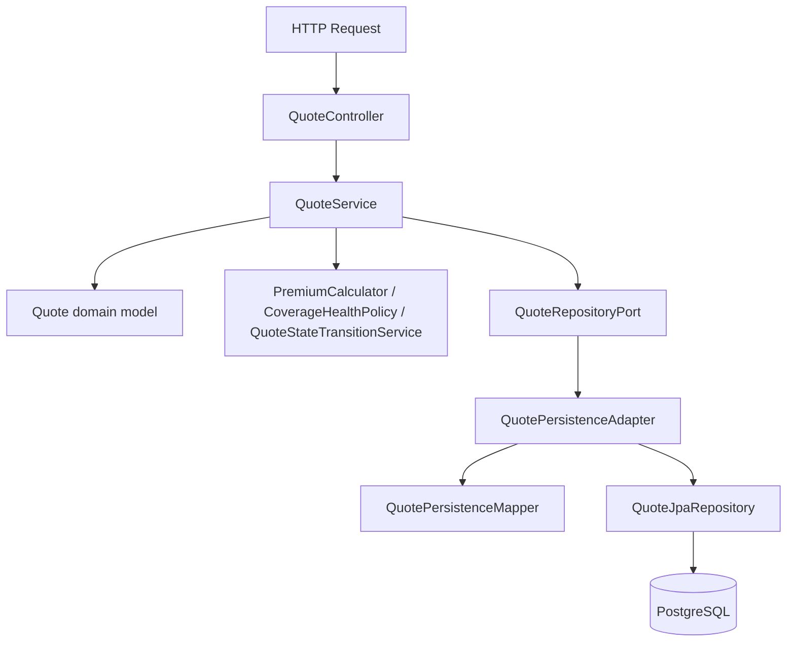
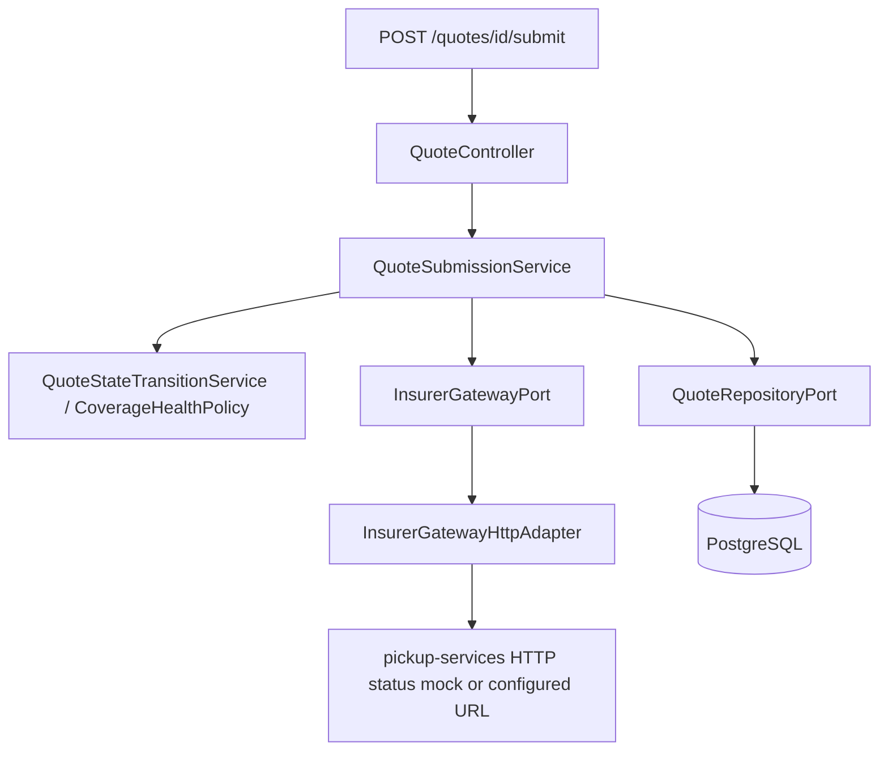

# Trustbuddy API — Architecture

Feature-oriented hexagonal architecture. Each business capability is a vertical slice with its own `domain`, `application`, and `infrastructure` packages. Shared cross-cutting concerns (security, OpenAPI) live at the app root under `config/`.

## Principles

- **Domain** — pure business logic; no Spring, JPA, HTTP, or database code.
- **Application** — use-case orchestration; depends on domain and port interfaces only.
- **Infrastructure** — framework-specific adapters that implement ports.
- **Ports** — interfaces in `application/port/`; implementations only in `infrastructure/`.
- **Mapping** — domain ↔ persistence and domain ↔ API DTOs stays in infrastructure adapters/mappers, not in domain.

Split by **business capability** (`quote/` today; `policy/`, `customer/` later) rather than by technical layer at the root.

## Why hexagonal here?

Spring Boot’s common **four-layer** layout (web → service → repository → database) is a reasonable default for simple apps. This API uses **hexagonal (ports and adapters)** so external integrations stay at the boundary — not because they are expected to change soon, but so they **could** without leaking into business logic:

- **PostgreSQL / JPA** — persistence is an implementation detail behind `QuoteRepositoryPort`.
- **Insurer submission** — external gateway HTTP call lives in `InsurerGatewayHttpAdapter`, not in `QuoteSubmissionService`.
- **Kafka** — submit events go through `QuoteEventPublisherPort`; the topic and serializer stay in infrastructure.
- **Redis** — cache read/evict behind `QuoteCachePort`.

Application services orchestrate domain rules and call port interfaces. If Kafka, the insurer API, or the database ever changes, new adapters can plug in without rewrites of `PremiumCalculator` or `QuoteStateTransitionService`.

Spring and framework code remain at the boundary (`@RestController`, `@Entity`, `KafkaTemplate`, `RestClient`). The domain and application layers do not import them.

## Request flow (quote)

### Create / read / update coverage



### Submit



Controllers call application services directly today. Inbound port interfaces (`application/port/in/`) are optional and not used yet — add them when a capability grows multiple entry points (REST + scheduler + messaging).

The application layer never knows it is talking to PostgreSQL or a specific HTTP client library.

## Root layout

```
src/main/java/com/trustbuddy/api/
  TrustbuddyApiApplication.java    # Spring Boot entry point
  config/                          # shared @Configuration (bean wiring; security/OpenAPI planned)

  quote/                           # quote capability (feature module)
    application/
    domain/
    infrastructure/
```

Mirror tests under `src/test/java/com/trustbuddy/api/quote/`.

## Quote capability layout

```
quote/
├── application/
│   ├── port/
│   │   └── out/                         # outbound ports
│   │       ├── QuoteRepositoryPort.java
│   │       ├── InsurerGatewayPort.java
│   │       └── InsurerSubmissionResult.java
│   └── service/                         # use case implementations
│       ├── QuoteService.java            # create, update coverage, get, list
│       └── QuoteSubmissionService.java  # submit to insurer gateway
│
├── domain/
│   ├── model/                           # Quote, QuoteStatus, CoverageType, ConditionType
│   ├── service/                         # pure domain services
│   │   ├── PremiumCalculator.java
│   │   ├── PremiumMultiplier.java       # + Age, Tobacco, Spouse, Conditions, BasePremium
│   │   ├── CoverageHealthPolicy.java    # age-gated pre-existing condition rules
│   │   └── QuoteStateTransitionService.java
│   └── exception/                       # DomainException hierarchy
│
└── infrastructure/
    ├── web/
    │   ├── controller/                  # QuoteController
    │   ├── request/                     # CreateQuoteRequest, UpdateCoverageRequest
    │   ├── response/                    # QuoteResponse, ErrorResponse
    │   ├── mapper/                      # QuoteWebMapper
    │   └── exception/                   # GlobalExceptionHandler
    ├── persistence/
    │   ├── entity/                      # QuoteEntity
    │   ├── repository/                  # QuoteJpaRepository
    │   ├── adapter/                     # QuotePersistenceAdapter
    │   └── mapper/                      # QuotePersistenceMapper
    ├── client/                          # InsurerGatewayHttpAdapter
    ├── messaging/                       # Kafka producer/consumer (planned)
    └── scheduler/                       # DraftExpirationJob (planned)
```

### Still planned

| Area | Package / type |
|------|----------------|
| Inbound ports | `application/port/in/*UseCase` (optional) |
| Value objects | `domain/valueobject/` (`Email`, `Money`, etc.) |
| Cache | `QuoteCachePort` + Redis adapter |
| Events | `QuoteEventPublisherPort` + Kafka adapter |
| Auth | JWT filter, `AuthController` under `config/` or shared `infrastructure/` |
| Scheduler | draft expiration job |

## What belongs in each layer

### Domain (`quote/domain/`)

| Package | Contents |
|---------|----------|
| `model/` | Aggregates and enums (`Quote`, `QuoteStatus`, `CoverageType`, `ConditionType`) |
| `service/` | Pure domain services (`PremiumCalculator`, `CoverageHealthPolicy`, `QuoteStateTransitionService`) |
| `exception/` | `DomainException`, `QuoteNotFoundException`, `InvalidQuoteStateException`, `QuoteValidationException`, `ConditionalFieldRejectedException`, `ExternalSubmissionException` |

Must compile in a plain Java project — no framework imports.

### Application (`quote/application/`)

| Package | Contents |
|---------|----------|
| `port/out/` | Outbound ports — what the app needs from infrastructure |
| `service/` | Use case implementations; depend on ports and domain only |

`QuoteService` orchestrates create, coverage update, get, and list. `QuoteSubmissionService` validates quote completeness, calls the insurer gateway, and applies state transitions. Application services do not contain SQL, HTTP, or Kafka code.

### Infrastructure (`quote/infrastructure/`)

| Package | Contents |
|---------|----------|
| `web/` | REST controllers, request/response DTOs, API mappers, HTTP exception handling |
| `persistence/` | JPA entities, Spring Data repos, persistence adapters and mappers |
| `client/` | HTTP clients to external APIs (insurer gateway via `RestClient`) |
| `messaging/` | Kafka producers/consumers (planned) |
| `scheduler/` | `@Scheduled` jobs (planned) |

This layer implements outbound ports and hosts inbound adapters.

## Ports and adapters

### Inbound (driving)

| Adapter | Location | Invokes |
|---------|----------|---------|
| REST controller | `infrastructure/web/controller/QuoteController` | `QuoteService`, `QuoteSubmissionService` |
| Scheduler | `infrastructure/scheduler/` (planned) | application services |
| Kafka consumer | `infrastructure/messaging/` (planned) | application services |

REST surface (challenge contract):

| Method | Path |
|--------|------|
| `POST` | `/quotes` |
| `PATCH` | `/quotes/{id}/coverage` |
| `POST` | `/quotes/{id}/submit` |
| `GET` | `/quotes/{id}` |
| `GET` | `/quotes` |

### Outbound (driven)

| Port | Adapter | Status |
|------|---------|--------|
| `QuoteRepositoryPort` | `QuotePersistenceAdapter` | implemented |
| `InsurerGatewayPort` | `InsurerGatewayHttpAdapter` | implemented (`app.insurer.gateway.url`, default pickup-services HTTP status mock) |
| `QuoteEventPublisherPort` | `KafkaQuoteEventPublisher` | planned |
| `QuoteCachePort` | `RedisQuoteCacheAdapter` | planned |

## Dependency rules

| Layer | May depend on | Must not depend on |
|-------|---------------|-------------------|
| `quote/domain/` | nothing outside domain | Spring, JPA, Kafka, Redis, HTTP |
| `quote/application/` | `quote/domain/` | JPA entities, controllers, Kafka templates |
| `quote/infrastructure/` | `quote/application/`, `quote/domain/` | other feature modules directly |
| `config/` | all layers | business logic |

## Testing layout

Tests mirror the capability packages:

| Layer | Examples |
|-------|----------|
| Domain | `PremiumCalculatorTest`, `CoverageHealthPolicyTest`, `QuoteStateTransitionServiceTest` |
| Application | `QuoteServiceTest`, `QuoteSubmissionServiceTest` (mock outbound ports) |
| Infrastructure | `QuotePersistenceAdapterTest` (`@DataJpaTest`), `QuoteControllerTest` (`@WebMvcTest`), `InsurerGatewayHttpAdapterTest` |
| Support | `testsupport/QuoteGenerator` — test data factory |

Run a subset with Surefire patterns: `make test-one TEST=QuoteSubmissionServiceTest` (class), `TEST='*Premium*'` (wildcard), or `TEST='com.trustbuddy.api.quote.domain.service.*'` (package). Full suite: `make verify`.

## Adding a new capability

1. Create `src/main/java/com/trustbuddy/api/<capability>/` with `application/`, `domain/`, `infrastructure/`.
2. Define domain models and services first.
3. Add outbound ports in `application/port/out/`.
4. Implement adapters in `infrastructure/`.
5. Add application services; introduce `application/port/in/` only when multiple inbound adapters share the same use case.
6. Expose via `infrastructure/web/` controllers.
7. Mirror tests under `src/test/java/com/trustbuddy/api/<capability>/`.

## Related docs

- [AGENTS.md](AGENTS.md) — agent instructions, REST conventions, testing checklist
- [README.md](README.md) — setup, API summary, and run instructions
