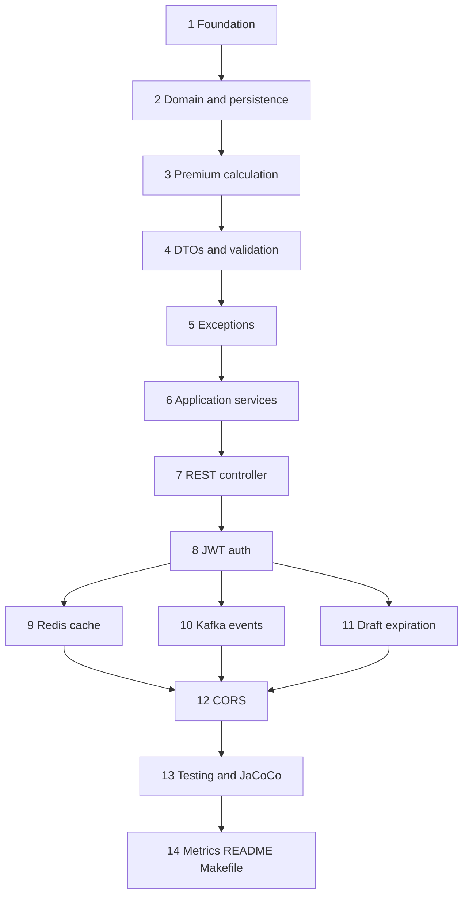

# Phased delivery journey

This API was built incrementally in **14 planned phases**, each scoped to a reviewable slice of work. The goal was to grow a production-shaped Spring Boot service without big-bang integration: compile and test after every step, keep hexagonal boundaries clean, and expose a single `make help` surface for local development.

This document summarizes **what was planned**, **what shipped**, and **how it maps to the codebase today**.

## Why phases?

| Principle | How it helped |
|-----------|----------------|
| Small PRs | Each phase (or sub-phase) could be reviewed, rebased, and CI-verified independently |
| Hexagonal layout first | Domain and ports stayed framework-free before JPA, Redis, Kafka, or security adapters |
| Makefile as contract | Every phase added or refined targets (`make test`, `make infra-up`, `make token`, …) |
| Verify gate | `make verify` (compile + tests + Checkstyle + SpotBugs + JaCoCo) before moving on |

## Phase overview

Phases **9**, **10**, and **11** were developed in parallel after **8** (separate branches/worktrees), then integrated through rebases onto `main`.

---

## Phase 1 — Foundation

**Planned:** Maven dependencies, profiles, Docker Compose (PostgreSQL, Redis, Kafka), app bootstrap, Makefile basics.

**Achieved:**

- Spring Boot 4.1, validation, security/JWT, Redis, Kafka, Testcontainers, JaCoCo
- `application.yml` + `application-dev.yml` / `application-docker.yml` / `application-prod.yml`
- `docker-compose.yml`, `Dockerfile`, `.env.example`
- `@EnableCaching`, `@EnableScheduling`, `@EnableKafka` on the application class
- Makefile: `help`, `compile`, `test`, `verify`, `infra-up`, `run`, `run-dev`

---

## Phase 2 — Domain and persistence

**Planned:** Enums, `Quote` aggregate, `QuoteRepositoryPort`, JPA adapter.

**Achieved:**

- `quote/domain/model/` — `Quote`, `QuoteStatus`, `CoverageType`, `ConditionType`
- `QuoteRepositoryPort` + `QuotePersistenceAdapter`, entity, mapper, Spring Data repository
- Later refactored: `PersonalInfo`, `CoverageDetails`, `QuoteAudit` value objects (Checkstyle-friendly constructors)

---

## Phase 3 — Premium calculation

**Planned:** Multiplier strategies, `PremiumCalculator`, unit tests.

**Achieved:**

- `AgeMultiplier`, `ConditionsMultiplier`, `TobaccoMultiplier`, `SpouseMultiplier`, `BasePremiumResolver`
- `PremiumCalculator` with example ($327.60) covered in `PremiumCalculatorTest`

---

## Phase 4 — DTOs and validation

**Planned:** Request/response DTOs, web mapper, conditional health rule.

**Achieved:**

- `CreateQuoteRequest`, `UpdateCoverageRequest`, `QuoteResponse`, `QuoteWebMapper`
- `CoverageHealthPolicy` + `CoverageHealthPolicyTest`
- Application-layer `CommandValidator` for create/update commands

---

## Phase 5 — Exception handling

**Planned:** Domain exceptions + global HTTP mapping.

**Achieved:**

- `QuoteNotFoundException`, `InvalidQuoteStateException`, `QuoteValidationException`, etc.
- `GlobalExceptionHandler` with consistent `ErrorResponse` JSON (401, 403, 404, 409, 400, 502)

---

## Phase 6 — Application use cases

**Planned:** State machine, `QuoteService`, insurer gateway port, `QuoteSubmissionService`.

**Achieved:**

- `QuoteStateTransitionService` (idempotent `SUBMITTED`, `SUBMISSION_FAILED` retry)
- `QuoteService` — create, update coverage, get (with cache read-through), list
- `InsurerGatewayPort` + `InsurerGatewayHttpAdapter` (configurable URL, timeout)
- `QuoteSubmissionService` + unit tests (`make test-submit`, `make test-state`)

---

## Phase 7 — REST controller

**Planned:** `QuoteController`, WebMvc tests.

**Achieved:**

- `POST /quotes`, `PATCH /quotes/{id}/coverage`, `POST /quotes/{id}/submit`, `GET` endpoints
- `QuoteControllerTest` (validation, 404, happy paths)
- Note: paths are `/quotes` (challenge contract), not `/api/v1/quotes` — documented deviation from internal REST conventions

---

## Phase 8 — JWT authentication

**Planned:** `JwtService`, `AuthController`, security filter chain, OpenAPI bearer scheme.

**Achieved:**

- `POST /auth/token`, `JwtAuthFilter`, `SecurityConfig`, `JwtAuthenticationEntryPoint` (Jackson 3 `JsonMapper`)
- `make token`, Swagger UI bearer auth, `QuoteSecurityTest`

---

## Phase 9 — Redis quote cache

**Planned:** `QuoteCachePort`, Redis adapter, cache on read, eviction on write.

**Achieved:**

- `RedisQuoteCacheAdapter`, `NoOpQuoteCacheAdapter`, configurable `cache-ttl-minutes`
- `@Primary` `CachingQuoteRepositoryAdapter` — evicts cache on every `save`
- `RedisQuoteCacheAdapterIT` (Testcontainers Redis)

---

## Phase 10 — Kafka submit events

**Planned:** `QuoteEventPublisherPort`, `QuoteSubmittedEvent`, publish on first successful submit.

**Achieved:**

- `KafkaQuoteEventPublisher`, `NoOpQuoteEventPublisher`, `KafkaConfig`
- Event payload: id, status, coverage type, premium, timestamp (no PII)
- `KafkaQuoteEventPublisherIT`, `make kafka-consume`

---

## Phase 11 — Draft expiration

**Planned:** `DraftExpirationService`, scheduled job, tests.

**Achieved:**

- `DraftExpirationJob` (`@Scheduled`), `app.quote.draft-expiration-minutes`
- `DraftExpirationServiceTest`; expired quotes return **409** on submit

---

## Phase 12 — CORS

**Planned:** `CorsConfig` integrated with `SecurityConfig`.

**Achieved:**

- `CorsProperties` (`app.cors.allowed-origins`), preflight tests in `QuoteSecurityTest`

---

## Phase 13 — Testing and JaCoCo

**Planned:** Fill adapter IT gaps, shared Testcontainers bases, Makefile coverage targets.

**Achieved:**

- `QuoteSubmitIT` — end-to-end create → coverage → submit (Postgres + Redis + JWT)
- `PostgresRedisTestcontainers`, `FullInfrastructureTestcontainers`
- `make coverage` (tests + JaCoCo only); JaCoCo report also on `make verify`

---

## Phase 14 — Metrics, README, Makefile polish

**Planned:** Micrometer counters, README refresh, `health` / `swagger-url` targets, grouped `make help`.

**Achieved:**

- `quote.submissions.total`, `quote.submissions.failed`, `quote.expired.total` via `QuoteMetrics`
- Updated [README.md](README.md) for current capabilities
- This document (`BUILD_JOURNEY.md`)
- Makefile: categorized help, `make health`, `make swagger-url`

---

## AI-assisted development

Parts of this codebase were built with **AI coding assistants** (Cursor Agent) under human review:

- Work was executed phase by phase; each PR was rebased, CI-verified, and reviewed before merge
- Agents followed [AGENTS.md](AGENTS.md) (hexagonal layout, test naming, PR discipline)
- Typical workflow: plan sub-phase → implement on a feature branch → `make verify` → open PR → address CI and review

AI accelerated boilerplate, test scaffolding, and conflict resolution during rebases; architecture choices, port boundaries, and merge decisions remained explicit in the plan and PR descriptions.

---

## Sibling frontend

This API is intended to pair with a separate React frontend (multi-step quote UI). Link the frontend repository in [README.md](README.md) when it is published.

## Further reading

- [ARCHITECTURE.md](ARCHITECTURE.md) — layer rules, diagrams, port table
- [AGENTS.md](AGENTS.md) — conventions for contributors and agents
- `make help` — categorized command reference
