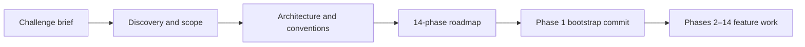
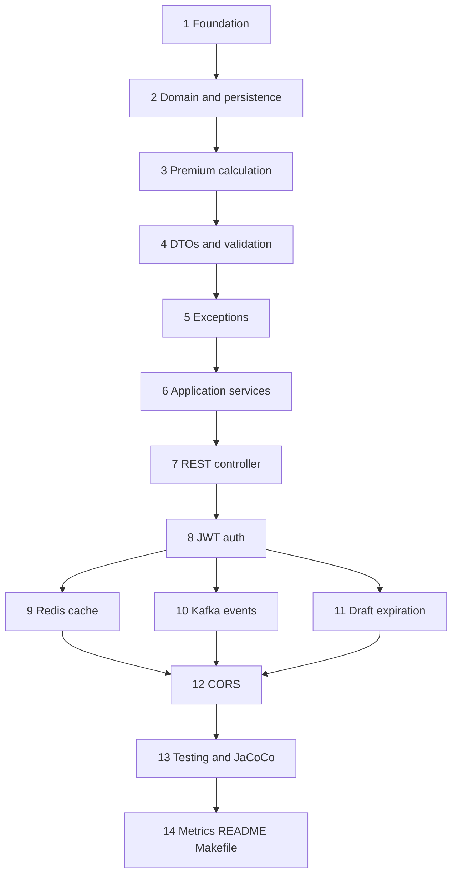

# Phased delivery journey

This API was built incrementally in **14 planned phases**, each scoped to a reviewable slice of work. The goal was to grow a production-shaped Spring Boot service without big-bang integration: compile and test after every step, keep hexagonal boundaries clean, and expose a single `make help` surface for local development.

This document summarizes **what happened before any feature code**, **what was planned**, **what shipped**, and **how it maps to the codebase today**.

## Before the plan and the code

Nothing in the repo appeared fully formed. The first useful step was **reading the Onboarding team challenge** and treating it as a contract: a multi-step insurance quote flow (create draft → set coverage and health answers → submit to an external insurer), with JWT-protected REST endpoints, PostgreSQL persistence, Redis caching, and a Kafka event on successful submit.

### Discovery (no implementation yet)

Before opening the IDE on domain classes or controllers, the work was entirely clarifying:

| Question | Outcome |
|----------|---------|
| What must the API expose? | CRUD-ish quote lifecycle under `/api/v1/quotes`, plus `POST /api/v1/auth/token` |
| What does “done” look like? | End-to-end flow works locally with Docker infra, tests pass, errors are consistent, README explains how to run it |
| What should production-shaped mean? | Hexagonal boundaries, env-based config, cache and messaging ports, scheduled expiration, observability hooks — not a single-layer demo |

This phase was conversations and notes, not commits. The deliverable was **shared understanding** of constraints and acceptance criteria.

### Architecture and conventions (still no feature code)

With requirements stable, a few decisions were locked in **before** writing quote logic:

- **Hexagonal, feature-oriented layout** — `quote/domain` stays pure Java; Spring, JPA, Redis, Kafka, and HTTP live in `quote/infrastructure` behind ports. See [ARCHITECTURE.md](ARCHITECTURE.md).
- **Makefile as the developer contract** — one entry point (`make help`, `make run-dev`, `make test`) so infra and the API are repeatable for reviewers and CI.
- **Verify gate from the start** — compile, tests, Checkstyle, SpotBugs (and later Error Prone, Spotless, JaCoCo) so quality does not get bolted on after the fact.

These choices did not require a running quote API — only agreement on *how* the code would be organized once it existed.

#### Researching Java and Spring Boot practices → [AGENTS.md](AGENTS.md)

Before feature code, time went into **better practices and conventions** for Java and Spring Boot — REST API design, validation at the DTO boundary, constructor injection, profile-based config, actuator usage, consistent error responses, and test structure.

The outcome of that research is mostly captured in **[AGENTS.md](AGENTS.md)**: repository hygiene, hexagonal layer rules, REST conventions, testing standards (given/when/then), and the verify checklist. That file became the single reference for human contributors and AI-assisted edits, so rules learned from Spring Boot guides and team preferences did not have to be re-explained in every PR. It shipped in the first commit alongside the bootstrap, before the quote domain existed.

#### Why hexagonal instead of the classic Spring layers?

Spring Boot tutorials often describe a **four-layer** stack — presentation (controllers), application/service, domain/persistence, and infrastructure (database). That works for CRUD apps, but it tends to **couple business logic to the stack**: services `@Autowired` with JPA repositories, `KafkaTemplate` in use cases, HTTP clients wired directly into submission flow.

This project talks to several **external integrations** that are stable for now but **might** be replaced later — without rewriting quote rules:

| External | Today | Might become (future) |
|----------|-------|------------------------|
| Database | PostgreSQL + JPA | another store or ORM |
| Insurer submission | HTTP gateway adapter | a different vendor API or message-based handoff |
| Events | Kafka publisher | SNS, RabbitMQ, or outbox + relay |
| Cache | Redis | in-memory or disabled |

Hexagonal architecture keeps those behind **ports** (`QuoteRepositoryPort`, `InsurerGatewayPort`, `QuoteEventPublisherPort`, `QuoteCachePort`). Application services depend on interfaces; if an adapter changes, premium calculation and state transitions stay untouched. Spring stays at the edges — controllers, JPA entities, Kafka templates — not in the domain center.

That was the main reason to explore ports and adapters here: **integrations are not expected to churn, but the layout avoids coupling the app to them if they do.**

### The 14-phase roadmap (plan before features)

Only after discovery and architecture did the **phased plan** appear. The intent was deliberate:

1. **No big-bang PR** — each phase compiles, tests, and merges independently.
2. **Inside-out delivery** — domain and ports before adapters; REST and security after use cases work.
3. **Parallel-friendly tail** — Redis (9), Kafka (10), and draft expiration (11) could branch after JWT (8) without blocking each other.

The phase list (foundation → domain → premium → DTOs → exceptions → services → REST → auth → cache/events/expiration → CORS → testing polish → metrics/docs) was the **schedule**, not the first commit.

### First commit: bootstrap only

The initial commit (`First commit`) shipped **Phase 1 foundation** — not business logic:

- Spring Boot 4.1 app shell, Maven wrapper, profiles (`dev` / `docker` / `prod` / `test`)
- Docker Compose for PostgreSQL, Redis, and Kafka; `Dockerfile` and `.env.example`
- Makefile with `help`, `compile`, `test`, `infra-up`, `run`
- Smoke test (`TrustbuddyApiApplicationTests`) proving the context starts
- [AGENTS.md](AGENTS.md) and a minimal [README.md](README.md) stating *“Quote domain and API endpoints start in Phase 2”*

There was **no** `Quote` aggregate, premium calculator, or controller yet. That separation — runnable skeleton first, feature code second — is what made the phased plan credible: every later phase had a green baseline to build on.

---

## Why phases?

| Principle | How it helped |
|-----------|----------------|
| Small PRs | Each phase (or sub-phase) could be reviewed, rebased, and CI-verified independently |
| Hexagonal layout first | Domain and ports stayed framework-free before JPA, Redis, Kafka, or security adapters |
| Makefile as contract | Every phase added or refined targets (`make test`, `make infra-up`, `make token`, …) |
| Verify gate | `make verify` (compile + tests + Checkstyle + SpotBugs + JaCoCo) before moving on |

## Phase overview

Phases **9**, **10**, and **11** were developed in parallel after **8** (separate branches/worktrees), then integrated through rebases onto `main`.

---

## Phase 1 — Foundation

**Planned:** Maven dependencies, profiles, Docker Compose (PostgreSQL, Redis, Kafka), app bootstrap, Makefile basics.

**Achieved:**

- Spring Boot 4.1, validation, security/JWT, Redis, Kafka, Testcontainers, JaCoCo
- `application.yml` + `application-dev.yml` / `application-docker.yml` / `application-prod.yml`
- `docker-compose.yml`, `Dockerfile`, `.env.example`
- `@EnableCaching`, `@EnableScheduling`, `@EnableKafka` on the application class
- Makefile: `help`, `compile`, `test`, `verify`, `infra-up`, `run`, `run-dev`

---

## Phase 2 — Domain and persistence

**Planned:** Enums, `Quote` aggregate, `QuoteRepositoryPort`, JPA adapter.

**Achieved:**

- `quote/domain/model/` — `Quote`, `QuoteStatus`, `CoverageType`, `ConditionType`
- `QuoteRepositoryPort` + `QuotePersistenceAdapter`, entity, mapper, Spring Data repository
- Later refactored: `PersonalInfo`, `CoverageDetails`, `QuoteAudit` value objects (Checkstyle-friendly constructors)

---

## Phase 3 — Premium calculation

**Planned:** Multiplier strategies, `PremiumCalculator`, unit tests.

**Achieved:**

- `AgeMultiplier`, `ConditionsMultiplier`, `TobaccoMultiplier`, `SpouseMultiplier`, `BasePremiumResolver`
- `PremiumCalculator` with example ($327.60) covered in `PremiumCalculatorTest`

---

## Phase 4 — DTOs and validation

**Planned:** Request/response DTOs, web mapper, conditional health rule.

**Achieved:**

- `CreateQuoteRequest`, `UpdateCoverageRequest`, `QuoteResponse`, `QuoteWebMapper`
- `CoverageHealthPolicy` + `CoverageHealthPolicyTest`
- Application-layer `CommandValidator` for create/update commands

---

## Phase 5 — Exception handling

**Planned:** Domain exceptions + global HTTP mapping.

**Achieved:**

- `QuoteNotFoundException`, `InvalidQuoteStateException`, `QuoteValidationException`, etc.
- `GlobalExceptionHandler` with consistent `ErrorResponse` JSON (401, 403, 404, 409, 400, 502)

---

## Phase 6 — Application use cases

**Planned:** State machine, `QuoteService`, insurer gateway port, `QuoteSubmissionService`.

**Achieved:**

- `QuoteStateTransitionService` (idempotent `SUBMITTED`, `SUBMISSION_FAILED` retry)
- `QuoteService` — create, update coverage, get (with cache read-through), list
- `InsurerGatewayPort` + `InsurerGatewayHttpAdapter` (configurable URL, timeout)
- `QuoteSubmissionService` + unit tests (`make test-submit`, `make test-state`)

---

## Phase 7 — REST controller

**Planned:** `QuoteController`, WebMvc tests.

**Achieved:**

- `POST /api/v1/quotes`, `PATCH /api/v1/quotes/{id}/coverage`, `POST /api/v1/quotes/{id}/submit`, `GET` endpoints
- `QuoteControllerTest` (validation, 404, happy paths)
- Versioned public paths under `/api/v1/...` (aligned with [AGENTS.md](AGENTS.md))

---

## Phase 8 — JWT authentication

**Planned:** `JwtService`, `AuthController`, security filter chain, OpenAPI bearer scheme.

**Achieved:**

- `POST /api/v1/auth/token`, `JwtAuthFilter`, `SecurityConfig`, `JwtAuthenticationEntryPoint` (Jackson 3 `JsonMapper`)
- `make token`, Swagger UI bearer auth, `QuoteSecurityTest`

---

## Phase 9 — Redis quote cache

**Planned:** `QuoteCachePort`, Redis adapter, cache on read, eviction on write.

**Achieved:**

- `RedisQuoteCacheAdapter`, `NoOpQuoteCacheAdapter`, configurable `cache-ttl-minutes`
- `@Primary` `CachingQuoteRepositoryAdapter` — evicts cache on every `save`
- `RedisQuoteCacheAdapterIT` (Testcontainers Redis)

---

## Phase 10 — Kafka submit events

**Planned:** `QuoteEventPublisherPort`, `QuoteSubmittedEvent`, publish on first successful submit.

**Achieved:**

- `KafkaQuoteEventPublisher`, `NoOpQuoteEventPublisher`, `KafkaConfig`
- Event payload: id, status, coverage type, premium, timestamp (no PII)
- `KafkaQuoteEventPublisherIT`, `make kafka-consume`

---

## Phase 11 — Draft expiration

**Planned:** `DraftExpirationService`, scheduled job, tests.

**Achieved:**

- `DraftExpirationJob` (`@Scheduled`), `app.quote.draft-expiration-minutes`
- `DraftExpirationServiceTest`; expired quotes return **409** on submit

---

## Phase 12 — CORS

**Planned:** `CorsConfig` integrated with `SecurityConfig`.

**Achieved:**

- `CorsProperties` (`app.cors.allowed-origins`), preflight tests in `QuoteSecurityTest`

---

## Phase 13 — Testing and JaCoCo

**Planned:** Fill adapter IT gaps, shared Testcontainers bases, Makefile coverage targets.

**Achieved:**

- `QuoteSubmitIT` — end-to-end create → coverage → submit (Postgres + Redis + JWT)
- `PostgresRedisTestcontainers`, `FullInfrastructureTestcontainers`
- `make coverage` (tests + JaCoCo only); JaCoCo report also on `make verify`

---

## Phase 14 — Metrics, README, Makefile polish

**Planned:** Micrometer counters, README refresh, `health` / `swagger-url` targets, grouped `make help`.

**Achieved:**

- `quote.submissions.total`, `quote.submissions.failed`, `quote.expired.total` via `QuoteMetrics`
- Updated [README.md](README.md) for current capabilities
- This document (`BUILD_JOURNEY.md`)
- Makefile: categorized help, `make health`, `make swagger-url`

---

## Dual authentication (Bearer + cookie)

After the 14-phase delivery, auth was extended so the **same JWT** works for API tools and browser clients without forking login flows.

**Motivation:**

- **Bearer header** — keeps Postman, Swagger, `make token`, and scripts unchanged.
- **HttpOnly cookie** — lets a same-origin React app send `credentials: 'include'` without storing the token in JavaScript (XSS mitigation).

**What shipped:**

- `AccessTokenCookieService` — resolves JWT from `Authorization: Bearer` (first) or `access_token` cookie; builds/clears `Set-Cookie` headers.
- `POST /api/v1/auth/token` — still returns `{ accessToken, tokenType, expiresInMs }` **and** sets the HttpOnly cookie.
- `POST /api/v1/auth/logout` — clears the cookie (`Max-Age=0`).
- `JwtAuthFilter` — authenticates from either carrier via one code path.
- Config: `app.jwt.cookie.*` (`name`, `secure`, `same-site`); `secure: true` in `application-prod.yml`.
- Tests: `AccessTokenCookieServiceTest`, cookie path in `QuoteSecurityTest`, Set-Cookie assertions in `AuthControllerTest`.

CSRF remains disabled (stateless API); cookie auth relies on `SameSite=Lax` and explicit CORS origins for browser use.

---

## AI-assisted development

Parts of this codebase were built with **AI coding assistants** (Cursor Agent) under human review:

- Work was executed phase by phase; each PR was rebased, CI-verified, and reviewed before merge
- Agents followed [AGENTS.md](AGENTS.md) (hexagonal layout, test naming, PR discipline)
- Typical workflow: plan sub-phase → implement on a feature branch → `make verify` → open PR → address CI and review

AI accelerated boilerplate, test scaffolding, and conflict resolution during rebases; architecture choices, port boundaries, and merge decisions remained explicit in the plan and PR descriptions.

---

## Sibling frontend

This API is intended to pair with a separate React frontend (multi-step quote UI). Link the frontend repository in [README.md](README.md) when it is published.

## Further reading

- [ARCHITECTURE.md](ARCHITECTURE.md) — layer rules, diagrams, port table
- [AGENTS.md](AGENTS.md) — conventions for contributors and agents
- `make help` — categorized command reference
